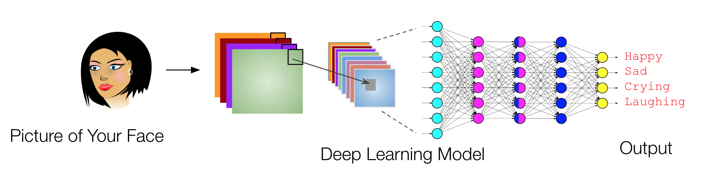

# Semester-long course project

The [lectures](../LECTURES.md) that we will cover will help you learn all the background to complete this semester-long course project.

## A. Objectives
The overall goal of working on this semester long project is to learn the foundations of using Tensorflow/Keras to build, train, and evaluate convolutional neural networks on an image dataset. If you are learning machine learning for the first time, a multi-class classification problem will probably be easier (not a regression problem). A problem is 'multi-class classification' if your output column has multiple options (cat, dog, horse, or a house). The main objective of the project is to design, implement, debug, evaluate, and benchmark deep convolutional neural network (CNN) architectures. You will create and curate your own dataset with at least a 1000 images. You may NOT use any pre-cleaned datasets, but you can collect images from the internet. (Professor Andrew Ng talks about the value of working on your own datadet in [this](https://youtu.be/1k37OcjH7BM) podcast.) You will also compare the accuracy and speed of various CNN architectures. Finally, you will study how data augmentation, regularization, and transfer learning can be used to improve the accuracy.

## B. Expectations
1. You will work on your projects individually (i.e. group submissions are not allowed).
1. Reports for all phases (including the final report) must be prepared using <a href="https://www.overleaf.com/">Overleaf</a>. Non-overleaf submissions will receive a 0 (zero). You are free to use any templates you want. [Here](https://www.overleaf.com/read/vgckqpfdyrwp) is an example. You can learn more about Overleaf [here](https://www.overleaf.com/learn/latex/LaTeX_video_tutorial_for_beginners_(video_1)). If you have accessibility needs please email me and I will waive this requirement.

## C. Phases
**In each phase you are exepected to submit:**  
1. An HTML version of the notebook
   - If you are using Google Colab, please convert the notebook to `.html` files and submit the `.html` files, for example using [htmltopdf](https://htmtopdf.herokuapp.com/ipynbviewer/).
1. A PDF report describing your findings (downloaded from your Overleaf project). The reports for the first three phases can be as long as you make them but the final report has limit on the number of pages. 
1. A link to view your Overleaf project.

## Tip for preparing notebooks
1. Read the [Ten Simple Rules for Reproducible Research in Jupyter Notebooks](https://arxiv.org/pdf/1810.08055.pdf)

Below is the list of all phases and the outline of what you will be working on in each phase. 

### Phase I. Data preparation
1. Watch the lectures in [Module 5](https://github.com/badriadhikari/Deep-Learning/blob/main/LECTURES.md#5-preparing-images-for-deep-learning-sections-362-524-and-525).
1. In this phase the first task is to decide a dataset for your project. If you don't have any other project in mind, please choose to work on a "mood classification" project. For the mood classification project, you will need to decide a few moods you want to detect (smiling, laughing, crying, neutral, etc.) and take a few hundred pictures for each mood. For example, you will need to take around 200 pictures of you smiling in various lighting conditions, various clothings, and in various places. It may run into your mind to create a video instead and extract frames as images but previous students have achived almost 100% accuracy with such approach so I don't encourage that.
1. The next step is to organize the dataset and visualize the images. A clean way to organize the images is to put them in folders by their categories. For example, put all 'smiling' pictures in one folder. The next step is to visualize sample images (a few images from your ~1000 images) in a Jupyter Notebook.
1. In your report you should discuss distribution of output labels, i.e., a bar diagram (or a table) showing how many images belong to which categories.
1. In your report you should also discuss how you plan to normalize your input images.

## Phase II. Build an overfitting model
1. Watch the lectures in [Module 6](https://github.com/badriadhikari/Deep-Learning/blob/main/LECTURES.md#6-the-convolution-operation-section-511) (the last lecture, in particular).
1. Using all the data (i.e. without splitting) obtain close to 100% accuracy. Build as large model as you need (with many filters and many layers). Here is an example:
   ```python
   model = Sequential()
   model.add( Conv2D( 64, ( 3, 3 ), activation = 'relu', input_shape = xtrain[0, :, :, :].shape ) )
   model.add( MaxPool2D(4, 4) )
   model.add( Conv2D( 32, ( 3, 3 ), activation = 'relu' ) )
   model.add( MaxPool2D(4, 4) )
   model.add( Conv2D( 16, ( 3, 3 ), activation = 'relu' ) )
   model.add( Flatten() )
   model.add( Dense( 10, activation = 'relu' ) )
   model.add( Dense( 10, activation = 'softmax' ) )
   ```
1. In your report you should discuss how the performance (accuracy, precision, recall, etc.) changes when the number of filters and layers are increased/decreased?
1. Plot your learning curves and include them in your report
1. [ONLY FOR GRADUATE STUDENTS] If you provide the output as the input (as an additional channel) what is the smallest architecture (minimum number of layers and filters) you need to overfit the data?
   ```python
   # Example of how to use output labels as additional input channel
   import numpy as np
   N = len(xtrain[:, 0, 0, 0])
   L = len(xtrain[0, :, 0, 0])
   xtrain_with_outputlabels = np.zeros((N, L, L, 2))
   for i in range(len(xtrain)):
      existing = xtrain[i, :, :, :]
      newchannel = np.full((L, L), ytrain_original[i]).reshape(L, L, 1)
      x = np.concatenate((existing, newchannel), axis = -1)
      print(existing.shape, newchannel.shape, x.shape)
      xtrain_with_outputlabels[i] = x
      break
    ```
   If you are using data generators, you can do something like the following to obtain your `xtrain` and `ytrain_original`:
   ```python
   # Empty placeholders for 1000 RGB images and their labels
   mydatax = np.zeros(1000, 256, 256, 3)
   mydatay = np.zeros(1000, 1)
   # Read everything from your generator
   for i in range(1000):
      x, y = your_generator()
      mydatax[i] = x
      mydatay[i] = y
   ```

## Phase III. Split and evaluate on test set
1. Watch the lecture in [Module 4](https://github.com/badriadhikari/Deep-Learning/blob/main/LECTURES.md#4-introduction-to-keras-sections-32-and-33).
1. Split your data into training, development, and test set
1. Train your model using the training set, 'Earlystop' using the validation set, and evaluate on the test set
1. Study the performance when the number of filters and layers are increased/changed
1. Plot your learning curves and include them in your report

## Phase IV. Effects of augmentation
1. Watch the lectures in [Module 5](https://github.com/badriadhikari/Deep-Learning/blob/main/LECTURES.md#5-preparing-images-for-deep-learning-sections-362-524-and-525).
1. With the best model obtained from the previous step, apply various techniques of data augmentation (Image generators) and study the improvement in accuracy
1. Plot your learning curves and include them in your report

## Phase V. Effects of regularization
1. Watch the lectures in [Module 8](https://github.com/badriadhikari/Deep-Learning/blob/main/LECTURES.md#8-model-evaluation-overfitting-underfitting--regularization-sections-42-44-and-45).
1. With the best model obtained from the previous step, apply various techniques of regularization (Batchnormalization, Dropout, L2 regularization, etc.) and study the improvement in accuracy
1. Plot your learning curves and include them in your report

## Phase VI. Use pretrained models and recent architectures 
1. Watch the lecture in [Module 9](https://github.com/badriadhikari/Deep-Learning/blob/main/LECTURES.md#9-classic-cnn-architectures-sections-511-512-and-71).
1. Use pretrained models such as VGG16 or ResNet50 and retrain using your dataset.
1. Use recent architectures such as ResNet, DenseNet, or NASNet to train a model and study the improvement in accuracy
1. Plot your learning curves and include them in your report

## Phase VII. Final report
* Your report must not be very long; 10/12 pages at most.
* All tables and figures must be numbered and captioned/labelled.
* Don't fill an entire page with a picture or have pictures hanging outside of the page borders.
* It is encouraged but not required to you host your project (and report) at Github.  
* Turn off the dark mode in Notebook before you copy images/plots (the lables and ticks are hard to see in dark mode).
* Your report should include an abstract and a conclusion (each 250 words minimum).

# Example Project
The goal in this project is to develop a convolutional neural network model that can identify my mood looking at a picture of my face. Here are the steps involved:
1. Take 1000 pictures of my face in various settings - smiling, laughing, sad, crying, and neutral - 200 images each. Then, label each of these pictures.
1. Crop images to 256 x 256 dimensions.
1. Write a Python matplotlib code to visualize all the 1000 images. 
1. Randomly spit the data into - 600 pictures for training, 200 for validation, and 200 for testing. 
1. Build a single layer CNN model with 64 filters, train the model, and evaluate the model on the test set. It is worth noting that the 5-class accuracy of a random classifier is 20% (baseline for the project).
1. Apply data augmentation techniques and regularization techniques to improve performance.
1. Build and test newer architectures such as ResNets and pre-trained models such as VGG-16.



## Previous semester student projects
* [Mood Detection](https://github.com/jnkx9c/DL_Project) - by Jeff Killgore
* [Categorizing Equus Members with Deep Learning](https://github.com/mykon23/DL-2020Project/blob/master/Categorizing_Equus_Members_with_Deep_Learning.pdf) - by Miguel Corona
* [Finger Digit Classification](https://github.com/kvong/DeepLearning-FingerDigitClassification) - by Khanh Vong

