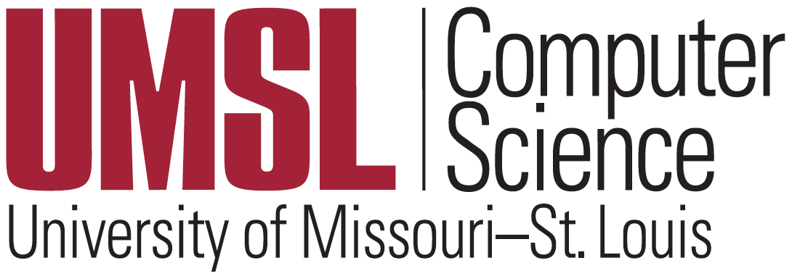
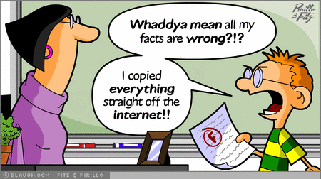

# Syllabus of Deep Learning (CMPSCI 4390/5390)

## 1. Instructor/facilitator

| Instructor (facilitator) | Contact information |
|:---|:---|
|  | Instructor (Facilitator): [Badri Adhikari](http://umsl.edu/~adhikarib/)   Email: adhikarib@edu.umsl   Class meets: Thursdays 5:30PM - 6:45PM (synchronously via Zoom; see Canvas for the zoom link)   Office hours: By appointment (right after class) |

**Teaching philosophy:** Computer science and technology is mostly a practical discipline. To learn the fundamentals, an effective strategy is to follow an iterative process of `reading, analyzing, and coding`. However, many students either like to `analyze` or `code` but not both. While some of us enjoy developing the skills for critically assessing the concepts and algorithms, many others enjoy programming and love building things. I think that an effective computer science course should be a balance of (a) theoretical knowledge to understand how computer technology works, and (b) implementation skills to test and execute the theories and algorithms. I design course contents and assignments so that students have an opportunity to improve both: analytical and programming skills. Students with a rich programming experience may find this balance slightly easier but will have a platform to explore further. For many others who do not consider themselves expert programmers, taking such a course will be a rewarding experience.

## 2. Course description

Deep learning is popular because of its high applicability and superior performance in domains where we use machine learning. Deep learning based applications have reached or surpassed human performance not only for industrial problems like object classification, speech recognition, and stock market prediction but also for many problems in the field of biology and medicine. Recently, deep learning is demonstrated to outperform human radiologists in detecting pneumonia from chest X-rays. It is also reliably used in iPhone-X for unlocking the phone through accurate face detection. Self-driving cars drive using the deep learning algorithms. Deep learning will soon replace humans in most domains of human mental labor. This course reviews a typical machine learning recipe, computational foundations for deep learning, and provides an introduction to deep learning of dense neural networks. The course will focus on building, training, and evaluating deep convolutional neural networks for solving various machine learning problems, particularly the ones relating to image data. At the end of the course you will also be able to differentiate what kinds of problems are best solved by deep learning algorithms and what are not, and develop your own deep learning applications. You will also learn major technology trends in deep learning and understand what makes it different from traditional machine learning.

**UMSL catalog description**
> This course reviews a typical machine learning recipe, mathematical foundations for deep learning, and provides an introduction to deep learning. Topics include dense neural networks, convolutional neural networks, and recurrent neural networks. The course will cover building, training, and using deep neural networks for solving various machine learning problems like image classification and protein contact prediction. Credit cannot be granted for both CMP SCI 4390 and CMP SCI 5390. \[3 credit units\].

## 3. Prerequisites  
CMPSCI 3130 (Design and Analysis of Algorithms) or Graduate Standing in CS

## 4. Learning outcomes  
**Upon completing the course students will be able to:**
* Use Python, Numpy and Keras to design, train, and evaluate convolutional neural network models
* Write Numpy and Tensorflow programs for building deep learning applications
* Learn computational foundations of machine learning and deep learning
* Learn the major technology trends in deep learning such as convolutional neural networks and residual neural networks
* Understand what makes deep learning different and powerful compared to traditional machine learning practices
* Understand the main parameters and hyper-parameters in a deep neural network
* Design, develop, train, debug, and evaluate deep neural networks
* Learn how to transfer the knowledge in pre-trained deep learning models to build models for new datasets

## 5. Textbook  
"Deep Learning with Python" by François Chollet by [Manning](https://www.manning.com/books/deep-learning-with-python); [pdf](http://faculty.neu.edu.cn/yury/AAI/Textbook/Deep%20Learning%20with%20Python.pdf); [examples](https://github.com/fchollet/deep-learning-with-python-notebooks) at GitHub 

## 6. Course topics  
1. Introduction to Python and Numpy
1. Introduction to deep learning (Sections 1.1, 1.2, 1.3, and 4.1)
1. Data representations & tensor operations (Sections 2.2, 2.3, and 2.4) 
1. Introduction to Keras (Sections 3.2 and 3.3) 
1. Preparing images for deep learning (Sections 3.6.2, 5.2.4, and 5.2.5)
1. The convolution operation (Section 5.1.1) 
1. Activations & loss functions (Sections 4.5.5, and Table 4.1) 
1. Model evaluation, overfitting, underfitting, & regularization (Sections 4.2, 4.4, and 4.5) 
1. Classic CNN architectures (Sections 5.1.1, 5.1.2, and 7.1) 
1. Deep learning practices (Sections 4.3, 5.3, 5.4, and 7.1) 
1. Limitations of deep learning (Section 9.2)

## 7. Course materials  
* All course materials are inside the relevant folders in Github
* Recorded lectures of the chapters are [here](./LECTURES.md)
 
## 8. Week-by-week course schedule (tentative)

1. **01/21**
   - Meeting topics: Syllabus + Start from Google Colab
   - Due next week:
      - Concept map homework: None
      - Quiz: None
      - Project: None

1. **01/28**
   - Meeting topics: QnA + Project ideas
   - Due next week:
      - Concept map homework: Module 2 (Introduction to DL)
      - Quiz: Module 2
      - Project: None

1. **02/04**
   - Meeting topics: QnA
   - Due next week:
      - Concept map homework: Module 3 (Data representations)
      - Quiz: Module 3
      - Project: None

1. **02/11**
   - Meeting topics: QnA
   - Due next week:
      - Concept map homework: Module 4 (Introduction to Keras)
      - Quiz: Module 4
      - Project: None

1. **02/18**
   - Meeting topics: QnA
   - Due next week:
      - Concept map homework: Module 5 (Preparing Images)
      - Quiz: Module 5
      - Project: None

1. **02/25**
   - Meeting topics: QnA
   - Due next week:
      - Concept map homework: Module 6 (The Convolution Operation)
      - Quiz: Module 6
      - Project: Phase I Report

## 9. Academic dishonesty
Any form of academic dishonesty in this class will result in an F for the semester and the case will be referred to the provost's office for possible further disciplinary action, regardless of how trivial it is. Please don't use another student's assignment (or a solution in the internet) to complete your own assignment. Discussing the material is 'OK', but please do your work on your own. You should complete the homework alone, not together, and not in a group. If you have any questions about any of the lessons or the assignments, please contact me, and I will point you in the right direction. Please read [UMSL's policy](https://www.umsl.edu/services/academic/policy/academic-dishonesty.html) and keep yourself out of plagiarism. Also, please remember that our `turnitin` tool also automatically checks for plagiarism.

    

## 10. Programming language
Python3 is language for the course; you are expected to use Python3 for all of your classroom activities, homeworks, and project. You are also required to use [Google colab](https://colab.research.google.com) or your own hosted Jupyter Notebook for running your programs.

## 11. Due dates and late policy  
* Homeworks and project phases have their respective due dates (see Schedule).
* You can request a maximum two-day extension on any homeworks or project submissions - for up to two submissions. If you email me a few hours before a deadline and I don't reply you immediately, and if you have not used your two-day extensions, you can assume that the extension is granted automatically.
* Once you use your extension days, late submissions will get no points. But, there can be exceptions.

## 12. Course project
* See [here](PROJECT.md).

## 13. Homeworks
There will be two types of homeworks: [project homeworks](./PROJECT.md), and [drawing concept maps](./CONCEPT-MAP.md) as chapter summaries. Homeworks should be submitted via Canvas. Concept maps should be submitted to the respective discussion boards so they are visible to other students in the class. You can view the concept maps uploaded by other students in the class only after you have submitted yours.

## 14. Grade composition  

| Submission | Total Points |
| :--- | ---: |
| Chapter concept maps | 30 |
| Chapter quizes | 30 |
| Project | 40 |

Note: One (1) bonus point will be assigned to everyone who completes the course evaluation survey. Please email me once you submit the survey.

## 15.Grading scheme  

| Points      | Grade |
| ----------- | ----- |
| 100% to 94% | A     |
| <94% to 90% | A-    |
| <90% to 87% | B+    |
| <87% to 84% | B     |
| <84% to 80% | B-    |
| <80% to 77% | C+    |
| <77% to 74% | C     |
| <74% to 70% | C-    |
| <70% to 67% | D+    |
| <67% to 64% | D     |
| <64% to 61% | D-    |
| <61% to 0%  | F     |

## 16. Resources  
Your success in this class is important to me. If you need official accommodations, you have a right to have these met. If there are aspects of this course that prevent you from learning or exclude you, please let me know as soon as possible. Together we’ll develop strategies to meet both your needs and the requirements of the course. I encourage you to visit the following links to determine how you could improve your learning as well. 

* [Resources & Support](https://umsl.instructure.com/courses/44471/pages/student-resources-and-supports?module_item_id=454221)
* [Technology Assistance](https://umsl.instructure.com/courses/44471/pages/technology-assistance?module_item_id=454223)
